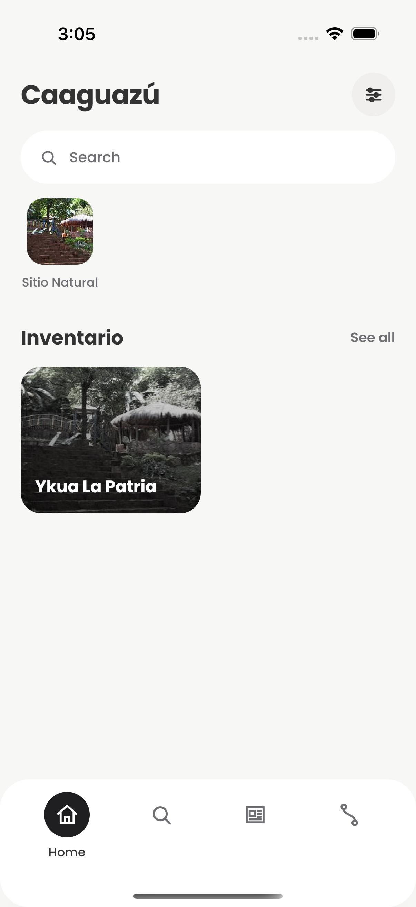
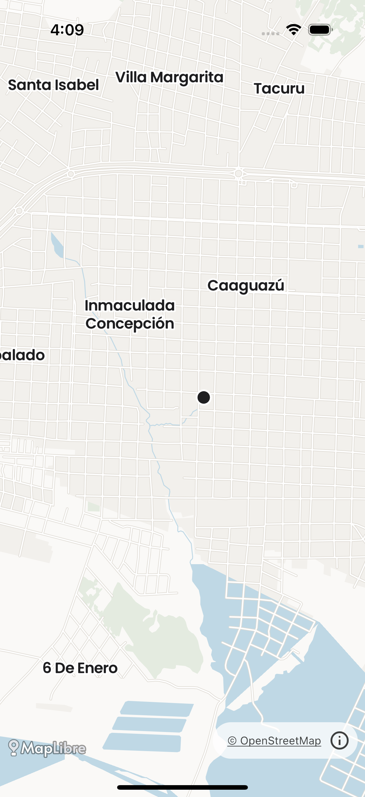

# iOS — qué se eligió, por qué, y qué hay hecho

Investigación y primer código para llevar la app a iOS. Lo que sigue separa
tres cosas que conviene no mezclar: **la decisión** (con qué se hace),
**lo construido** (qué hay en el repo), y **lo que falta** — que es la
mayor parte, y donde hay dos preguntas abiertas que no me corresponde
resolver solo.

---

## 1. La decisión: Compose Multiplatform

Las tres opciones que estaban sobre la mesa en `publicar-en-tiendas.md`:

| Opción | Reutiliza | Costo | Riesgo |
|---|---|---|---|
| Swift/SwiftUI de cero | nada | rehacer 9 pantallas + datos en otro lenguaje | dos apps que se desincronizan |
| KMP con interfaz en SwiftUI | datos y contrato | rehacer 9 pantallas en SwiftUI | el sistema visual se mantiene dos veces |
| **Compose Multiplatform** | **datos, contrato y pantallas** | adaptar lo que toca el sistema | API del mapa todavía inestable |
| Flutter / React Native | nada | reescribir todo | choca con casi todo lo decidido acá |

**Se eligió Compose Multiplatform (CMP).** La razón de fondo es una
decisión que ya estaba tomada en este proyecto por otro motivo: **no hay
Material3.** El sistema visual es propio de punta a punta —`Tono`, `Radio`,
`Elevacion`, `Medida`, `Letra`, e iconos dibujados a mano como
`ImageVector`— y todo eso es `compose.foundation` y `compose.ui`, que son
multiplataforma. Lo que parecía una restricción del proyecto es justamente
lo que hace que las pantallas puedan cruzar: no hay una capa de Material
atada a Android de la que despegarse.

La contraparte honesta: **CMP para iOS es estable desde 1.8.0 (mayo de
2025)**, pero `maplibre-compose` —el envoltorio del mapa— declara Android e
iOS en **beta**, y rompe la API entre versiones menores. Por eso su versión
queda fijada exacta en `libs.versions.toml` y no con rango.

### Lo que decidió la viabilidad

Había un único riesgo capaz de tumbar todo el enfoque, y era el mapa: los
2 MB de `caaguazu.pmtiles` que viajan dentro del APK. Si en iOS hubiera
hecho falta un servidor de tiles, se caía la premisa central del proyecto
—mapa sin servicios externos— y con ella el sentido de compartir código.

**MapLibre iOS tiene soporte nativo de `pmtiles://` desde la 6.10.** El
recorte cruza sin tocarlo, sin una línea de Swift y sin servidor. Ese dato
es el que convirtió la opción en viable, y está verificado contra la fuente
del propio MapLibre, no supuesto.

---

## 2. Lo construido

**Cuatro módulos, y las dos apps son la misma app.**

```
:compartido   el contrato con el panel, la red, la caché y el disco.
              Kotlin puro, sin Compose de interfaz.
                     ▲
:interfaz     el sistema visual y TODAS las pantallas, una sola vez.
              Compose Multiplatform.
              ▲                              ▲
:app                                    :ios
la cáscara de Android:                  la cáscara de iOS:
Activity, Application,                  un archivo, `puntoDeEntrada()`.
registro a Logcat, avisos
con WorkManager.
```

Las dos cáscaras son chicas a propósito. Si alguna empieza a crecer, es que
algo que debería compartirse se está escribiendo dos veces.

### Por qué fue posible mudar las pantallas casi sin tocarlas

De los 7.465 renglones de interfaz que había en `:app`, **la gran mayoría
cruzó sin cambiar una línea**. Eso no fue suerte: el proyecto decidió hace
tiempo **no usar Material3** y dibujar su propio sistema sobre
`compose.foundation`. Justamente por eso las pantallas nunca estuvieron
atadas a Android.

Lo que sí hubo que resolver es chico y está junto, cada cosa en su archivo
`.android.kt` / `.ios.kt` al lado de su `expect`:

| Qué | Android | iOS |
|---|---|---|
| `Preferencias` | `SharedPreferences` | `NSUserDefaults` |
| `Empaquetado` (textos de respaldo) | assets del APK | el bundle |
| `Sistema.idiomaDelTelefono` | `Locale` | `NSLocale` |
| `Sistema.animacionesActivas` | escala de animación | *Reducir movimiento* |
| `Sistema.abrirUrl` | `Intent.ACTION_VIEW` | `UIApplication.openURL` |
| `Sistema.agendar` | `ACTION_INSERT` | un `.ics` a la hoja de compartir |
| `Sistema.compartirTexto` | `ACTION_SEND` | `UIActivityViewController` |
| `Sans` / `Serif` | `R.font` | los mismos `.ttf`, del bundle |
| `LienzoMapa` | `MapView` en un `AndroidView` | `maplibre-compose` |
| `estiloDelMapa` | copia el `.pmtiles` a disco | lee el bundle |
| `ManejarVolver` | `BackHandler` | nada: iOS no lo tiene |
| `FilaDeAvisos` | el interruptor | nada: sin avisos en la v1 |

### Tres cosas que se ganaron de paso

- **El GeoJSON de los pines es uno solo.** Antes había dos versiones —la de
  Android mandaba `color`, la de iOS mandaba `tipo` y `categoria`— y ya se
  habían separado sin que nadie lo notara.
- **Las fechas dejaron de depender de la plataforma.** Interpretar un ISO del
  panel usaba `SimpleDateFormat`; ahora es aritmética propia en `:compartido`,
  **con pruebas** que cubren el 29 de febrero, el año divisible por cien que
  no es bisiesto, y el signo del desplazamiento horario. De esa función
  dependen el botón de agendar y la ventana de avisos.
- **Los guardianes ahora miran también el código de iOS.** `SinRedaccionTest`,
  `SistemaDeDisenoTest` y `ClavesDeTextoTest` recorren los cinco juegos de
  fuentes del proyecto. En la primera corrida pescaron un `"evento.ics"` que
  parecía una clave de texto.

### Dos dependencias, y por qué no fueron cuatro

Coil 3 es multiplataforma pero no trae motor de red: en iOS lo esperado sería
**Ktor más su motor Darwin**, dos dependencias nuevas para bajar fotos. En su
lugar hay un `NetworkClient` propio de unas cincuenta líneas sobre la misma
`NSURLSession` que ya usa `Http` — la interfaz que hay que implementar es **un
solo método**, leído del artefacto y no supuesto. Lo único que se sumó es
`coil-network-core`, de la misma familia que Coil.

Es el mismo criterio que llevó a resolver `Http` con NSURLSession en vez de
Ktor, y responde a una regla explícita del proyecto: no agregar una
dependencia que se pueda evitar.

**Un aviso que queda abierto, y conviene tenerlo anotado:** al compilar para
iOS, Gradle avisa que `coil-core` trae `skiko:0.9.4` y que Compose lo sube a
`0.150.1`. Compila igual y es sólo un aviso. Pero si algún día las fotos no se
dibujan en iPhone y sí en Android, **ese aviso es el primer sospechoso** —
Skiko es el motor de dibujo, y una versión que no es la que Coil esperaba es
exactamente la clase de cosa que rompe la decodificación de imágenes sin dar
un error claro. No se toca ahora porque tocarlo a ciegas es peor.

Lo mismo con el aviso de que el plugin de Compose es 1.11.1 y las
dependencias resuelven a 1.12.0: viene de que `:compartido` declara el
`androidx.compose.runtime` que usa `:app`. Estaba igual antes de esta mudanza
y compila; alinearlo es trabajo pendiente, no un fallo.

## 3. La app corriendo en un iPhone



Esa captura sale del simulador en el CI, y **no es una maqueta**: es
`Aplicacion()`, la misma función que dibuja la app de Android, corriendo en
iOS. Cada cosa que se ve ahí es una pieza que cruzó:

- **El título grande en Poppins.** Las tipografías se leen del bundle con
  `Font(identity, getData = { ... })`, que es la apuesta que permitió no
  agregar Compose Resources.
- **El buscador como píldora de radio completo sobre relleno claro** — el
  sistema visual entero: `Tono`, `Radio`, `Medida`, `Letra`.
- **Las dos fotos, traídas de `caaguazu.net`.** O sea que el motor de red de
  Coil escrito sobre NSURLSession funciona.
- **El botón redondo de perfil, la barra inferior y la píldora oscura en la
  sección activa.**

Y los textos en inglés no son un error: el simulador está en inglés, así que
`Sistema.idiomaDelTelefono` devolvió `"en"` y la app abrió leyendo `en.json`
del bundle. "Inventario" sale en castellano porque esa clave falta en inglés y
cae al original — las tres capas de `Textos`, funcionando.

El registro del sistema de esa corrida no tiene un solo error: los TLS
completaron y las conexiones al panel funcionaron. Lo que se ve vacío abajo es
que el panel tenía poco contenido cargado, no un fallo de la app.

Lo que esa captura **no** dice: cómo se siente en la mano. Eso sigue
necesitando una persona con un iPhone.

---

## 3. Qué está verificado y qué no

Esto importa más que lo anterior, porque el proyecto tiene una regla
explícita contra dar por bueno lo que no se comprobó.

**Verificado, corriendo:**

- `:app` compila y sus 30 pruebas pasan con los modelos y el analizador ya
  movidos a `:compartido` — la app Android está intacta.
- Las 5 pruebas del contrato compartido pasan en la JVM.
- `maplibre-compose 0.17.0` publica `iosArm64` e `iosSimulatorArm64`, y
  **no** publica `iosX64`. Leído de su Gradle module metadata; por eso el
  simulador Intel queda afuera de los targets y no por preferencia.
- Las firmas de la API del mapa (`MaplibreMap`, `rememberMapState`,
  `BaseStyle.Json`, `CameraPosition`, `Position`) salieron de las fuentes
  publicadas del artefacto, no de memoria. En particular: `Position` es
  **(longitud, latitud)** —el orden de GeoJSON, no el que se dice en voz
  alta— y por eso el código usa argumentos nombrados.

**Verificado también, y esto es lo importante: el mapa se dibuja.**



Esa captura sale del workflow **"Captura de iOS"**, que arma el proyecto de
Xcode con XcodeGen, compila la app, arranca un simulador de iPhone, la corre
y fotografía. En ella se ve, y cada cosa comprueba algo distinto:

- **La red de calles, el agua y los nombres de lugar** — el `.pmtiles` de
  2 MB leyéndose del bundle, sin servidor de tiles.
- **Los nombres en Poppins** — los glifos resolvieron, o sea que la carpeta
  del mapa entró al bundle con su estructura intacta. Era el fallo silencioso
  que más preocupaba.
- **`© OpenStreetMap`** abajo a la derecha — la ODbL cumplida.
- **El pin oscuro al centro** — viene de `/mapa/markers`, traído por red con
  NSURLSession y decodificado con los modelos compartidos. El camino de datos
  completo, de punta a punta.

Lo que sigue sin comprobar: cómo se siente en un **iPhone de verdad**, con
los dedos. Un simulador no dice nada del tamaño real de los textos ni de si
el mapa se arrastra con soltura. Eso lo comprueba una persona.

**Lo que costó llegar hasta acá**, porque la próxima vez conviene saberlo: el
mapa compiló y arrancó mucho antes de que se pudiera ver, y cinco cosas
distintas lo tapaban. En orden: el simulador Intel, que no existe para este
framework; el `import` del framework, que faltaba y que además no podía
llamarse igual que la app; la clave `CADisableMinimumFrameDurationOnPhone`,
sin la cual Compose Multiplatform se niega a arrancar; los Compose Resources
de las dependencias, que no viajaban en el bundle; y un `NSLog` con un String
de Kotlin, que mataba el proceso justo al anotar la primera línea. Ninguna de
las cinco se veía sin correr la app de verdad.

---

## 4. Lo que falta

### En el código

1. **El registro a disco.** En Android hay un archivo rotativo que la pantalla
   de diagnóstico exporta; en iOS son las últimas 500 líneas en memoria. Sirve
   para ver qué pasó en esta corrida, no para diagnosticar algo de ayer.
2. **Los avisos**, que están fuera de la v1 por decisión tomada.
3. **Mirarla en un iPhone.** Que compile y que se dibuje en un simulador no es
   lo mismo que que se sienta bien en la mano.

### Fuera del código

- [ ] Cuenta de **Apple Developer Program** (USD 99/año).
- [ ] Certificados de firma y perfiles de aprovisionamiento.
- [ ] Ficha de App Store Connect: capturas y descripciones, con las medidas de
      Apple. Texto de producto: lo escribe una persona.
- [ ] **App Privacy ("nutrition label")**: con la misma auditoría que la de
      Play, la respuesta es "Data Not Collected" en casi todo.

Para compilarla en una Mac, los pasos exactos están en
[`docs/compilar-en-mac.md`](compilar-en-mac.md).

## 5. Las dos preguntas, ya decididas

**El cliente HTTP: `expect`/`actual` sobre NSURLSession**, sin dependencia
nueva. La medida que decidió: `Http` son 131 líneas y lo atado a la JVM era
**una** función privada de unas 35 (`pedir()`). El ETag con 304, el
reintento corto y la caída a la copia guardada son Kotlin puro y se
comparten. Agregar Ktor para no duplicar 35 líneas era un mal canje.

**Los avisos: fuera de la primera versión de iOS.** El equivalente de
WorkManager en iOS, `BGAppRefreshTask`, es explícitamente *best-effort*: el
sistema decide si corre y cuándo. Sale sin avisos y sin el interruptor,
antes que con uno que promete lo que no puede cumplir. No se toca el "no hay
push".

---

## 6. Cerrado en la revisión del 2026-09-18

Tres cosas que el camino a la App Store necesitaba y que no estaban:

- **El ícono.** No había ninguno: la app se instalaba con el cuadrado gris
  de iOS, y App Store Connect rechaza una subida sin él. Se agregó
  `ios/xcode/Recursos/Assets.xcassets`, con un PNG de 1024×1024 opaco y sin
  redondear (con canal alfa es `ITMS-90717`), generado del mismo vector que
  el de Android. El workflow comprueba que `actool` dejó los derivados
  dentro del `.app`.
- **No se podía compilar para un teléfono.** Dos causas, las dos en
  `project.yml`: `CODE_SIGNING_ALLOWED: NO` estaba en `settings.base`, o sea
  para todas las configuraciones y no solo para el simulador, así que un
  archivado salía sin firmar; y el framework de Kotlin se buscaba en una
  única ruta fija, `iosSimulatorArm64/debugFramework`. Ahora la ruta va por
  SDK y por configuración —cuatro combinaciones— y el enlace se hace con
  `-framework TurismoKit` en `OTHER_LDFLAGS`, porque una dependencia
  declarada no puede ser condicional. El workflow compila también con
  `-sdk iphoneos` y comprueba con `lipo` que el binario es arm64 de
  teléfono: es la mitad del camino que antes nadie miraba.
- **`ITSAppUsesNonExemptEncryption: false`** en el Info.plist. La app solo
  usa HTTPS, que es un uso exento de la normativa de exportación; sin la
  clave, App Store Connect pregunta por el cifrado en cada subida.

Lo que sigue sin comprobarse, y hay que decirlo: **nada de esto se archivó
ni se subió de verdad**. Que compile y enlace para `iphoneos` sin firmar es
lo más lejos que llega un runner sin cuenta de desarrollador. Firmar,
archivar y que App Store Connect acepte el paquete son tres pasos que
necesitan la cuenta y una Mac.
